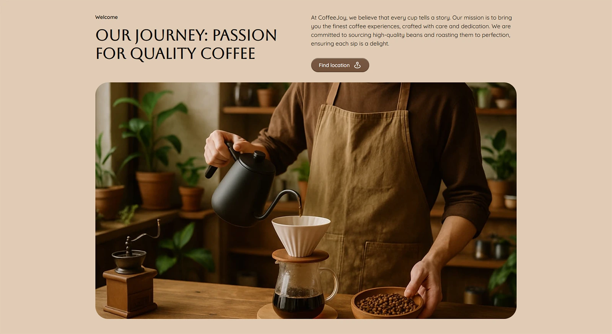

# CoffeeJoy Website

Responsive one-page CoffeeJoy website built with HTML5, CSS3 and JavaScript.

---

## Live Demo

[CoffeeJoy](https://github.com/achupylko/coffeejoy-website/)

---

## Preview


---

## Technologies Used

- HTML5
- CSS3
- JavaScript
- Responsive Design
- Mobile First
- SVG Sprite
- Modern Normalize
- Prettier

---

## Features

- Responsive layout
- Mobile-first approach
- Semantic HTML5 markup
- Adaptive design for mobile, tablet and desktop
- Smooth anchor navigation
- Optimized assets
- Cross-browser compatibility
- Retina-ready images

---

## Team Project

This project was developed as a team project during Fullstack Web Developer
course.

---

## My Role

I was responsible for developing the `Welcome` section, including:

- responsive layout implementation;
- semantic HTML structure;
- adaptive styling for mobile, tablet and desktop;
- image optimization;
- section styling and positioning.



---

## Installation

Clone the repository:

```bash
git clone https://github.com/achupylko/coffeejoy-website.git
```

Go to the project folder:

```bash
cd coffeejoy-website
```

Open `index.html` in your browser.

---

## Project Structure

```text
src/
├── css/
├── img/
├── js/
├── partials/
├── public/
├── index.html
└── main.js
```

---

## Future Improvements

- Improve animations and interactions
- Optimize performance and accessibility

---

## Author

Developed by _[Artem Chupylko](https://github.com/achupylko)_ as part of a
Fullstack Web Developer learning journey.
